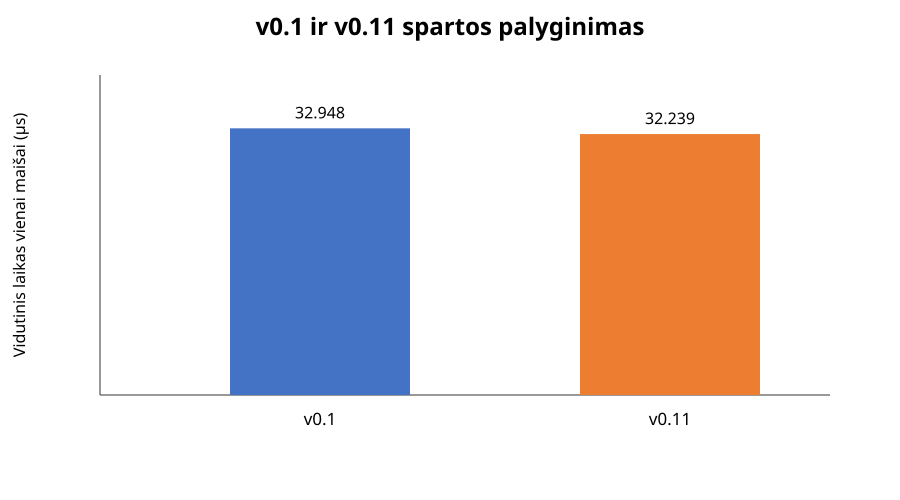
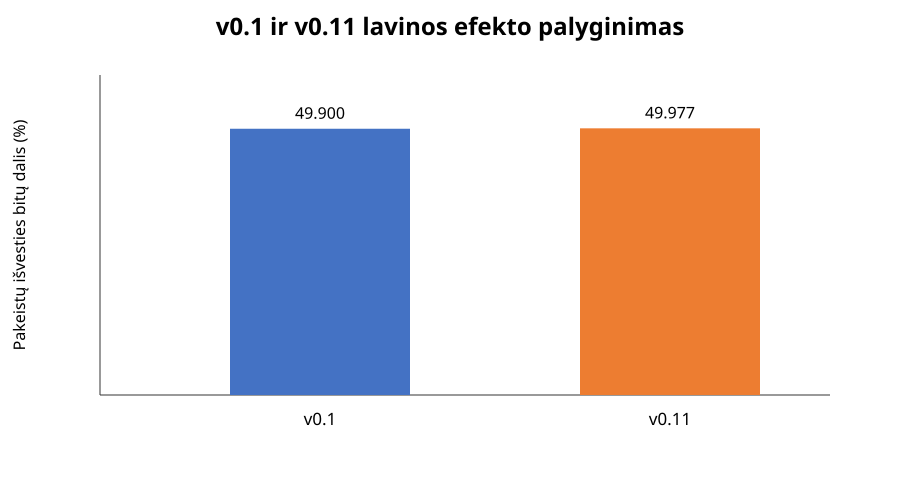
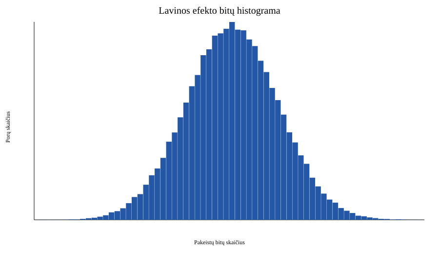
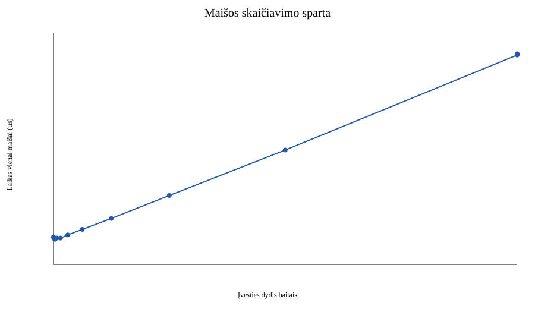

# Mokomasis maišos generatorius

Šis failas aprašo dvi projekto versijas ir jų palyginimą:

- **`v0.1`** – mano savarankiškai sukurta versija, parengta be DI pagalbos.
- **`v0.11`** – DI asistuotas mano `v0.1` algoritmo patobulinimas.

Toliau aprašomi abu algoritmai ir jų eksperimentinis palyginimas.

## A. `v0.1` – mano savarankiškas darbas

Ši versija sukurta savarankiškai, be DI pagalbos. Algoritmo kūrimas pradėtas
nuo SHA-256 struktūros nukopijavimo, o vėliau jo komponentai buvo keičiami ir
pritaikomi savam algoritmui.

### A.1. Įvadas

Maišos funkcija kintamo ilgio įvesties baitų seką paverčia fiksuoto ilgio
reikšme. Ta pati baitų seka turi duoti tą patį rezultatą, o nedidelis įvesties
pakeitimas turėtų pakeisti didelę išvesties dalį.

Šio darbo tikslas yra praktiškai išbandyti šias savybes ir parodyti jų
ribotumą. Nerastos kolizijos arba geras lavinos efektas savaime neįrodo
kriptografinio saugumo.

### A.2. Kas pakeista lyginant su SHA-256

Kūrimas pradėtas nuo SHA-256 struktūros, tačiau `v0.1` nėra tiesioginis
standartinio algoritmo iškvietimas. Pagrindiniai pakeitimai yra šie:

- **`sigmaZero`**: SHA-256 naudoja tris operacijas su vienu žodžiu
  (`ROTR(7) XOR ROTR(18) XOR SHR(3)`). Šiame algoritme naudojama
  `ROTL(7)`, `ROTL(13)`, poslinkis į kairę per 5 bitus ir dvigubas XNOR:
  `XNOR(XNOR(ROTL(x, 7), ROTL(x, 13)), x << 5)`.
- **`sigmaOne`**: vietoje SHA-256 `ROTR(17) XOR ROTR(19) XOR SHR(10)`
  naudojama `ROTR(8) XOR ROTR(19) XOR SHR(5)`.
- **Žodžių išplėtimas**: SHA-256 formulė naudoja
  `W[t-2]`, `W[t-7]`, `W[t-15]` ir `W[t-16]`. Čia naudojama pakeista
  formulė `sigmaOne(W[t-3]) + W[t-4] + sigmaZero(W[t-10]) + W[t-16]`.
- **`choose`**: SHA-256 `Ch` funkcija turi tris įvesties žodžius
  (`x`, `y`, `z`). Čia funkcija gauna **šešis** žodžius: `a`, `b`, `c`, `e`,
  `f`, `g`. Lyginiams bitų numeriams naudojami `a,b,c`, nelyginiams –
  `e,f,g`.
- **`majority`**: SHA-256 `Maj` funkcija naudoja tris žodžius. Čia dauguma
  skaičiuojama iš **penkių** žodžių: `a`, `b`, `c`, `e`, `f`. Bitas nustatomas
  į 1, kai bent trys iš penkių atitinkamų bitų yra 1.
- **Didžiosios sigma funkcijos** taip pat pakeistos: naudojamos kairinės
  rotacijos `ROTL(3)`, `ROTL(14)`, `ROTL(25)` ir `ROTL(5)`, `ROTL(11)`,
  `ROTL(27)`, o ne SHA-256 rotacijų rinkiniai.

### Pseudokodas

```text
maiša(įvesties_baitai):
    papildyti įvestį 0x80, nuliais ir pradiniu ilgiu
    būsena H = 8 pradiniai 32 bitų žodžiai

    kiekvienam 64 baitų blokui:
        W[0..15] = bloko žodžiai
        kiekvienam t nuo 16 iki 63:
            W[t] = sigmaOne(W[t-3]) + W[t-4]
                   + sigmaZero(W[t-10]) + W[t-16]

        a,b,c,d,e,f,g,h = H
        kiekvienam t nuo 0 iki 63:
            T1 = h + bigSigmaOne(e)
                 + choose(a,b,c,e,f,g) + K[t] + W[t]
            T2 = bigSigmaZero(a) + majority(a,b,c,e,f)

            h = g; g = f; f = e; e = d + T1
            d = c; c = b; b = a; a = T1 + T2

        H = H + (a,b,c,d,e,f,g,h)

    grąžinti H kaip 32 baitus hex formatu
```

Taigi SHA-256 buvo pradinis atskaitos taškas, tačiau pakeistos būtent
maišymo, žodžių išplėtimo, pasirinkimo ir daugumos operacijos. Dėl to
rezultatas nėra SHA-256 rezultatas ir nėra suderinamas su SHA-256
realizacijomis.

SHA-256 veikimo principą ir pagrindines algoritmo dalis mokiausi iš šio
vaizdo įrašo: [SHA-256 paaiškinimas](https://www.youtube.com/watch?v=orIgy2MjqrA).

### A.3. Paleidimo instrukcijos (`v0.11`)

Reikalingas C++20 kompiliatorius:

```bash
mkdir -p build
c++ -std=c++20 -O2 -Wall -Wextra -pedantic src/main.cpp -o build/hash_generator

build/hash_generator --text "labas pasauli"
build/hash_generator --file /kelias/iki/failo.bin
printf 'tekstas' | build/hash_generator --stdin
```

Programos režimai:

- `--text` maišo komandų eilutės argumento baitus. Papildomas `Enter` simbolis
  nepridedamas.
- `--file` failą skaito dvejetainiu režimu, todėl maišomi tikslūs jo baitai,
  o ne failo pavadinimas.
- `--stdin` skaito tikslų dvejetainį standartinės įvesties srautą.
- eksperimentų scenarijus įvestis perduoda paketais per atskirą palyginimo
  adapterį.

UTF-8 tekstas apdorojamas kaip jo UTF-8 baitai. Tarpai, raidžių registras,
eilučių pabaigos ir kiti baitai nėra normalizuojami. Neegzistuojantis arba
neperskaitomas failas pateikia klaidos pranešimą ir nelaikomas tuščia įvestimi.

Išvestis yra 256 bitų, arba 32 baitų, maiša, užrašyta 64 mažosiomis
šešioliktainėmis raidėmis. Pradiniai nuliai išsaugomi. Įvesties dydį praktiškai
riboja turima operatyvioji atmintis.

### A.4. Testai

Automatiniai testai tikrina:

- tuščią, vieno baito ir UTF-8 įvestį;
- fiksuotą 64 simbolių hex išvesties ilgį;
- determinizmą ir skirtingų įvesčių atskyrimą;
- failo ir teksto režimų sutapimą, kai baitai vienodi;
- dvejetainę `stdin` įvestį;
- klaidos pranešimą neperskaitomo failo atveju.

Paleidimas:

```bash
python3 -m unittest discover -s tests -v
```

### A.5. Reprodukavimo aplinka

Versijų palyginimo scenarijus yra `experiments/compare_versions.py`. Jis
kompiliuoja abi versijas su vienodomis parinktimis ir išsaugo duomenis
`results/` kataloge:

```bash
python3 experiments/compare_versions.py
```

## C. `v0.11` – patobulinta mano versija

`v0.11` yra DI asistuota `v0.1` algoritmo patobulinta versija. `v0.1` išlieka
nepakeistas kaip mano savarankiškas atskaitos taškas, o ši šaka aiškiai
atskiria AI pasiūlytus maišos funkcijos pakeitimus.

Palyginti su `v0.1`, `v0.11`:

- pakeičia pradinių būsenos žodžių rinkinius į naują pirminių skaičių rinkinį;
- pakeičia `bigSigmaZero` ir `bigSigmaOne` rotacijų kombinacijas;
- sustiprina `sigmaZero` ir `sigmaOne`, papildydama jas papildomomis
  rotacijomis;
- pakeičia žodžių išplėtimą į
  `sigmaOne(W[t-2]) + W[t-7] + sigmaZero(W[t-15]) + W[t-16]`;
- pataiso penkių įvesčių `majority` pavadinimus ir tiksliai dokumentuoja,
  kad naudojami `a,b,c,d,e`;
- nebehashina visada tik `"hello"`, o priima `--text`, `--file` ir `--stdin`;
- failus skaito dvejetainiu režimu, todėl nekeičiami jų baitai;
- tikrina neteisingą režimą ir neperskaitomą failą, grąžindama aiškią klaidą;
- vienodai pateikia 256 bitų rezultatą su pradiniais nuliais;
- turi vienodą mašininę sąsają, kurią galima naudoti atkuriamiems bandymams.

`v0.1` ir `v0.11` buvo kompiliuoti tais pačiais parametrais ir išbandyti su
tais pačiais 1000 deterministiškai sugeneruotų įvesčių. Lavinos efektui vienas
baitas kiekvienoje įvestyje pakeistas, o pakeistų išvesties bitų procentas
skaičiuotas nuo 256 bitų.

| Versija | Įvesčių skaičius | Vid. laikas (µs) | Lavinos efektas bitais (vid.) | Hex skirtumas (vid.) |
|---|---:|---:|---:|---:|
| `v0.1` | 1000 | 32.948 | 49.900% | 93.778% |
| `v0.11` | 1000 | 32.239 | 49.977% | 93.906% |

Pilni skaičiavimai pateikti faile
[`results/v01_v011_comparison.csv`](results/v01_v011_comparison.csv), o juos
atkartoja `python3 experiments/compare_versions.py`.

### `v0.1` ir `v0.11` grafikai

**Sparta:**



**Lavinos efektas:**



### A.6. Eksperimentų rezultatai

#### A.6.1. Įvesties ir išvesties patikra

`results/correctness.json` patvirtina, kad išbandytos tuščia, vieno baito,
ASCII, UTF-8, eilučių pabaigos ir 256 baitų įvestys. Visais 9 atvejais
išvesties ilgis buvo 64 hex simboliai, o pakartotinis skaičiavimas davė tą
pačią reikšmę.

Pavyzdžiai:

| Įvesties baitų skaičius | Maišos ilgis | Maišos reikšmė |
|---:|---:|---|
| 0 | 64 | `5bf99dd18d8278f0c3d390607dcb1aeba7b2a462183fb406e5796f86585a047a` |
| 1 (`a`) | 64 | `c9824f483af8c3b7f83060996567cee0f1b740e445a51bd4890aeb3193c7d1f4` |
| 7 (`ąžuolas`) | 64 | `a64d3dafae727f052469756fb2bd1294823280dee432e016797e8ab410e285c0` |

#### A.6.2. Kolizijų paieška

Kiekvienam ilgiui sugeneruota ir patikrinta 100 000 skirtingų ASCII porų.
Papildomai tikrintas nedidelis struktūruotų įvesčių rinkinys.

| Įvesties ilgis | Porų skaičius | Porų kolizijos | Viso rinkinio kolizijų grupės |
|---:|---:|---:|---:|
| 10 | 100 000 | 0 | 0 |
| 100 | 100 000 | 0 | 0 |
| 500 | 100 000 | 0 | 0 |
| 1 000 | 100 000 | 0 | 0 |
| Struktūruotos įvestys | 5 | 0 | 0 |

Rezultatai saugomi [`results/collisions.csv`](results/collisions.csv). Kadangi
maišos ilgis yra 256 bitai, tokio dydžio atsitiktiniame bandyme kolizijos
neradimas yra tikėtinas ir neįrodo atsparumo kryptingai atakai.

#### A.6.3. Lavinos efektas

Iš viso patikrinta 100 000 porų, po 25 000 kiekvienam ilgiui. Kiekvienoje
poroje pakeistas vienas ASCII simbolis kitu tos pačios abėcėlės simboliu.

| Ilgis | Bitų skirtumas min. | Bitų skirtumas maks. | Bitų skirtumas vid. | Hex skirtumas min. | Hex skirtumas maks. | Hex skirtumas vid. |
|---:|---:|---:|---:|---:|---:|---:|
| 10 | 36.719% | 62.891% | 49.977% | 78.125% | 100.000% | 93.748% |
| 100 | 37.500% | 61.719% | 50.032% | 79.688% | 100.000% | 93.750% |
| 500 | 37.891% | 62.500% | 50.003% | 76.563% | 100.000% | 93.749% |
| 1 000 | 37.109% | 62.500% | 50.010% | 78.125% | 100.000% | 93.756% |

Vidutinis bitų skirtumas yra apie 50 %, o hex simbolių skirtumas – apie
93,75 %. Tai atitinka orientacines nepriklausomų atsitiktinių išvesčių
reikšmes. Bitų skirtumo histograma pateikta


Žali histogramo duomenys pateikti
[`results/avalanche_histogram.csv`](results/avalanche_histogram.csv), o visos
statistikos – [`results/avalanche.csv`](results/avalanche.csv).

Geras lavinos efektas gali egzistuoti ir konstrukcijoje, kuri turi kitų
struktūrinių silpnybių, todėl šis eksperimentas nėra saugumo įrodymas.

#### A.6.4. Spartos analizė

Naudotas fiksuotas sugeneruotas UTF-8 tekstas. Buvo matuojamos 1, 2, 4, 8, ir
taip toliau eilučių ištraukos bei visas failas. Įvestis buvo paruošta prieš
matavimą, atlikti 5 matavimo kvietimai. Šio pakartojimo lentelėje įskaičiuotas
vieno proceso paleidimas ir standartinės įvesties perdavimas, todėl skaičiai
nėra tiesiogiai lygintini su ankstesne lentelės versija.

| Baitai | Eilutės | Vidurkis (µs) | Min. (µs) | Maks. (µs) |
|---:|---:|---:|---:|---:|
| 85 | 1 | 1 675.875 | 1 549.833 | 1 784.916 |
| 680 | 8 | 1 532.908 | 1 469.667 | 1 614.250 |
| 5 440 | 64 | 1 795.792 | 1 753.291 | 1 836.792 |
| 43 520 | 512 | 4 194.258 | 4 058.666 | 4 413.250 |
| 87 040 | 1 024 | 6 960.150 | 6 809.958 | 7 087.083 |
| 174 080 | 2 048 | 12 746.400 | 12 401.417 | 13 133.166 |

Pilna lentelė pateikta [`results/benchmark.csv`](results/benchmark.csv).



Didėjant įvesties
dydžiui laikas auga beveik tiesiškai, nes didėja apdorojamų 64 baitų blokų
skaičius. Mažų įvesčių matavimus labiau veikia pastovios funkcijos sąnaudos.

#### A.6.5. Spėjimas, vieša druska ir slaptas atsitiktinumas

Tikslinė įvestis buvo `0420`, o kandidatų rinkinį sudarė visos eilutės nuo
`0000` iki `9999`. Be druskos ir su vieša druska `VU-2026` rasta po vieną
sutampantį kandidatą:

| Režimas | Kandidatų | Sutapę kandidatai | Laikas (s) |
|---|---:|---|---:|
| Be druskos | 10 000 | `0420` | 0.048653 |
| Vieša druska `VU-2026` | 10 000 | `0420` | 0.051423 |

Rezultatai saugomi [`results/preimage.csv`](results/preimage.csv). Mažas
kandidatų rinkinys gali būti perrenkamas net ir tada, kai maišos išvestis atrodo
atsitiktinė. Vieša druska nekeičia vieno taikinio paieškos dydžio, tačiau
neleidžia aklai pakartotinai naudoti iš anksto apskaičiuotų rezultatų kitai
druskai. Slaptas atsitiktinis `r` padidintų paieškos erdvę tol, kol `r` nebūtų
atskleistas; šiame darbe didelės `r` erdvės perrinkimas neatliekamas.

#### A.6.6. Išvados

Eksperimentai patvirtino, kad programa yra deterministinė, grąžina fiksuoto
ilgio rezultatą, apdoroja skirtingo dydžio baitų sekas ir rodo gerą statistinį
lavinos efektą. Spartos priklausomybė nuo įvesties dydžio yra beveik tiesinė.

Tačiau testai neįrodo atsparumo kryptingoms kolizijų ar pirmavaizdžio atakoms,
neįrodo, kad konstrukcija nenutekina informacijos, ir neįvertina visų galimų
įvesčių. Nenustatyta kolizija tik reiškia, kad jos nerasta naudotame ribotame
rinkinyje. Realioms sistemoms turi būti naudojamos patikrintos kriptografinės
konstrukcijos, o slaptažodžiams – specializuotos schemos, pavyzdžiui,
`Argon2id`.

### A.7. Rezultatų atkūrimas

Visi pradiniai matavimai, statistikos ir grafikas laikomi repozitorijoje:

- [`results/correctness.json`](results/correctness.json)
- [`results/benchmark.csv`](results/benchmark.csv)
- [`results/benchmark.svg`](results/benchmark.svg)
- [`results/collisions.csv`](results/collisions.csv)
- [`results/avalanche.csv`](results/avalanche.csv)
- [`results/avalanche_histogram.csv`](results/avalanche_histogram.csv)
- [`results/avalanche_histogram.svg`](results/avalanche_histogram.svg)
- [`results/preimage.csv`](results/preimage.csv)
- [`results/metadata.txt`](results/metadata.txt)

Šis pakartojimas apėmė 9 correctness įvesčių, 100 000 kolizijų porų kiekvienam
ilgiui, 100 000 lavinos porų, spartos matavimus ir 10 000 kandidatų spėjimą.
Eksperimentai atkuriami viena komanda:

```bash
python3 experiments/run_experiments.py
```
